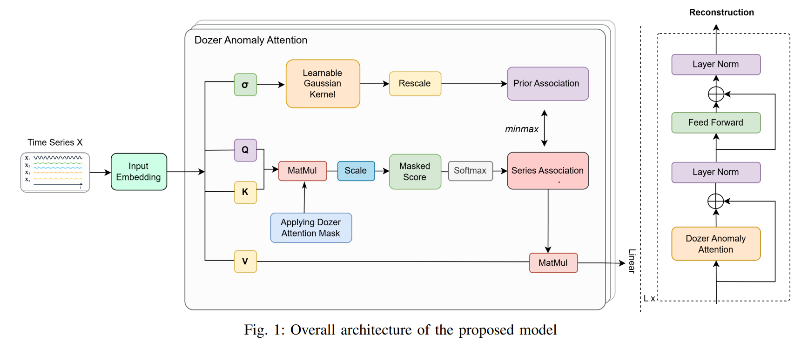
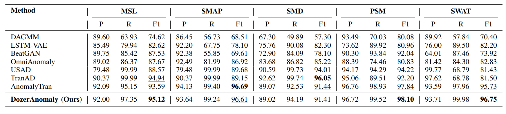
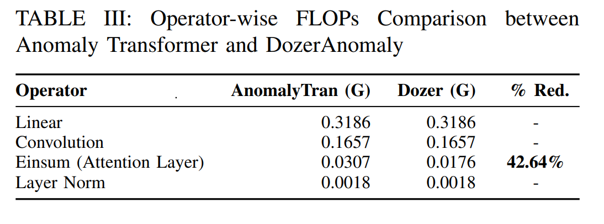
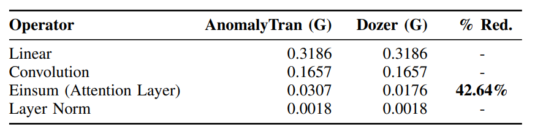
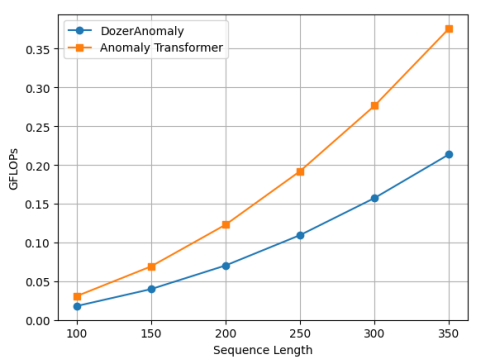

# Sparse Transformer for Anomaly Detection with Association Discrepancy
##### (Submitted to ICTAI 2025)

Abstract—Multivariate time-series anomaly detection aims to
identify deviations from normal behaviour in data streams
collected simultaneously from multiple sensors and systems. This
approach is widely used across diverse industries to support
smooth operation, maintenance, and fault prevention. Modelling
complex temporal dynamics presents a significant challenge.
In recent years, transformer-based models such as Anomaly
Transformer have shown remarkable performance due to their
ability to model long-range temporal dependencies. However,
transformer is burdened by the computational inefficiency of
standard attention mechanism. In this paper, we propose a novel
transformer-based model, DozerAnomaly, that can efficiently
detect anomalies in multivariate time series. We integrated a
sparse attention mechanism, Dozer self-attention, with local and
seasonal adaptation that captures the locality and seasonality of
data patterns. It addresses the quadratic complexity of standard
self-attention mechanism by focusing only on relevant time steps,
thereby reducing computational overhead. We employ the association discrepancy between prior and series associations to distinguish normal and abnormal time series patterns. Experimental
results in real-world datasets show that our model achieves stateof-the-art performance in terms of both accuracy and efficiency
with a 42.64% reduction in floating-point operations (FLOPs)
compared to the baseline, significantly improving computational
efficiency without compromising accuracy

# Model Architecture


# Getting  Started

 1. Install Python 3.6, PyTorch >= 1.4.0.
2. Download the dataset. You can obtain four benchmarks from [Google Cloud](https://drive.google.com/drive/folders/1gisthCoE-RrKJ0j3KPV7xiibhHWT9qRm?usp=sharing). **All the datasets are well pre-processed**. Create a folder named "dataset" in the root directory and place all the datasets inside the folder.
3. Train and evaluate. We provide the experiment scripts of all benchmarks under the folder `./scripts`. To obtain experimental results, run the following scripts:
```bash
bash ./scripts/SMD.sh
bash ./scripts/MSL.sh
bash ./scripts/SMAP.sh
bash ./scripts/PSM.sh
```

# Results
#### Experimental results on Accuracy (F1 Score)
Anomaly detection performance of various models across different datasets (Precision, Recall, F1 %); bestperforming scores are bolded, and second-best are underlined.


#### Computational Efficiency
<!--  -->
 Operator-wise FLOPs Comparison between
Anomaly Transformer and DozerAnomal



#### Parameter Sensitivity
Effect of Sequence length on Computational Efficiency



# Contact
If you have any questions, please contact [ss472s@MissouriState.edu](mailto:ss472s@MissouriState.edu) or hellosanjeev4@gmail.com.
